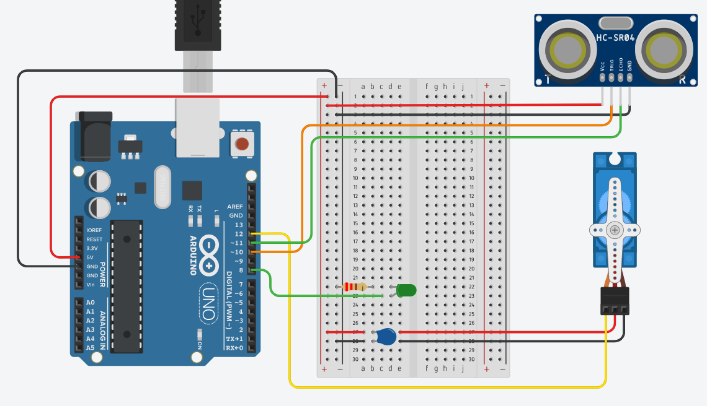
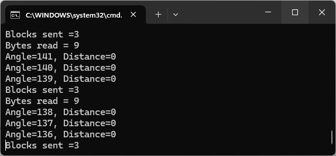

# Sonar with Arduino, C#, JavaScript and HTML5

Visual Studio solution includes:
- Arduino project (`sonar`)
- .NET Framework 4.7.2 console application (`SonarServer`)
- .NET Framework 4.7.2 web application (`SonarWeb`)

Work is based on https://en.morzel.net/post/OoB-Sonar-with-Arduino-C-JavaScript-and-HTML5 by Milosz Orzel
with various modifications.

## How to run

1. Open `sonar.ino` with Arduino IDE and upload sketch to Arduino.
2. From the command line run the sonar server with the port name as argument, e.g: `SonarServer.exe COM7`.
   Arduino IDE must be closed prior to running the sonar server console application so the serial port can be accessed.   
4. Open Index.html in a browser *or* set `SonarWeb` as the startup project in Visual Studio and press F5 to start debugging.

## Circuit diagram

## Sonar Server 

## Sonar Web

